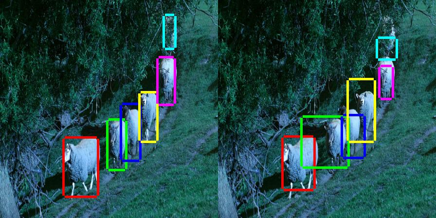
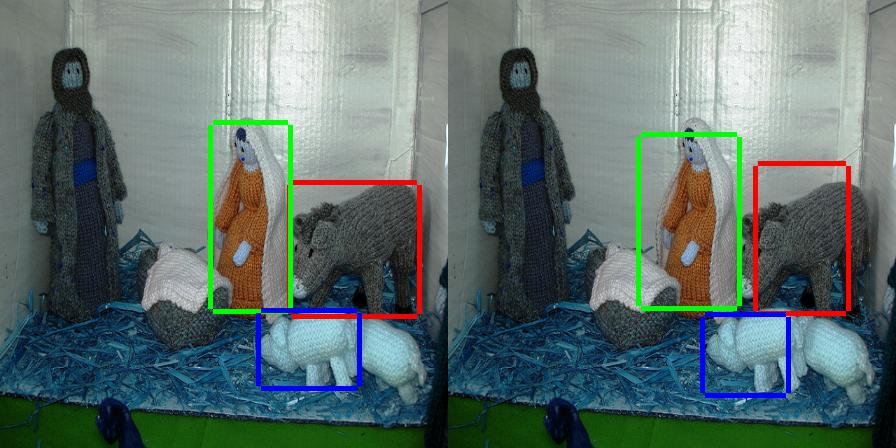
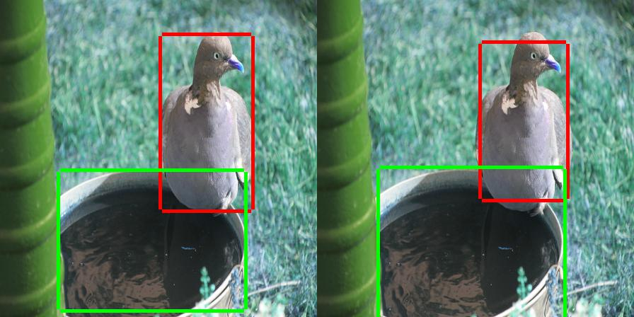
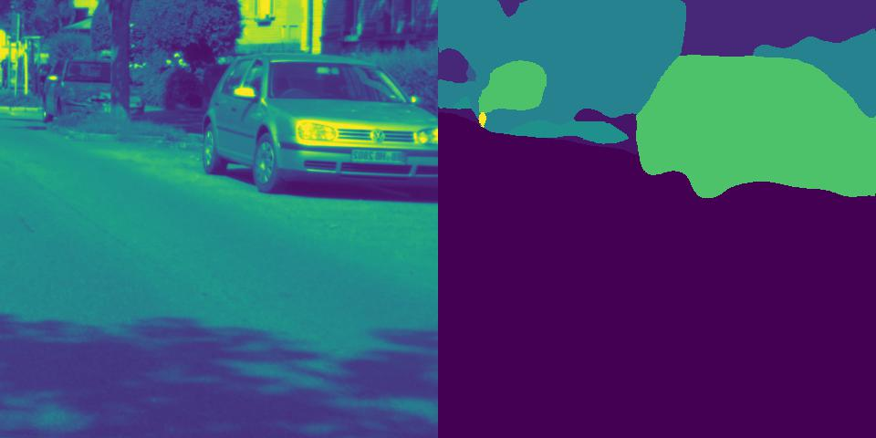

# Deep Learning Templates

This repository contains template code for the following deep learning tasks:
1. Image Classification

2. Object Detection

<p float="left">
   \
   \
  
</p>

3. Semantic Segmentation

<p float="left">
   \
   \
  
</p>

4. Reinforcement Learning (Proximal Policy Optimization)

 \

## Getting Started

It is intended to run on our lab servers
1. icsrl-exxact1.ece.gatech.edu
2. icsrl-srv2.ece.gatech.edu

Lastly there are two things you need to configure before running:
1. Dataset Path
2. Transfer Learning weights

Both of these are available on the server and can be configured by setting the exxact flag in the script.
* *exxact=1* implies you are working on the *exxact* server
* *exxact=0* implies you are working on the *icsrl2* server

## Affiliation 

```
Georgia Institute of Technology, ICSRL (http://icsrl.ece.gatech.edu/)
```


## License

This project is licensed under the MIT License - see the [LICENSE.md](LICENSE.md) file for details


